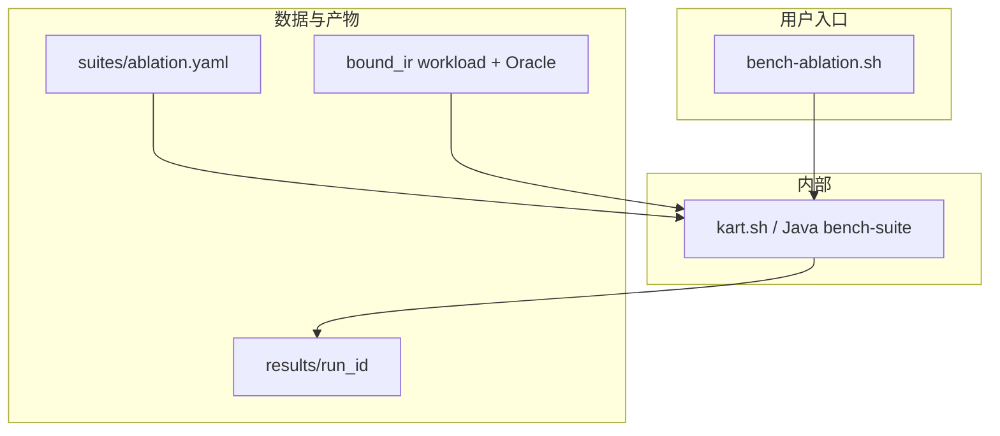

# KART 消融实验规范（Ablation）

- 版本：v0.1，2026-09-25
- 状态：规范已锁定（讨论结论）；harness / 引擎开关以本文操作化为准，缺口记为后续实现，**不豁免公平性**。
- 上游：`spec/design.md` §8–10、`spec/IMPLEMENTATION_PLAN.md` §19.2、`docs/environment-lock.md`
- 正交规范：[`spec/comparative_experiment.md`](comparative_experiment.md)（外部方法 / HBase 基线横比；**不**在消融中复用为臂）
- 数据与用例：与对比实验 E2/E3 同一 `experiments/workloads/bound_ir_v1.json` 及对应 Oracle

---

## 1. 目标与假设

### 1.1 目标

在**同一金标 BoundIR、同一 T-Drive 快照与同一 HBase 环境**下，对 KART **规划侧**做 leave-one-out 消融，量化各组件对正确性与延迟的贡献，支撑论文「规划层」主张：

1. LLM 动作提案相对规则 / Best-first 的价值
2. 动作搜索相对「LLM 一次吐完整计划」的价值
3. Fast Cost（搜索引导）与 Final Cost（SafePlan 选优）各自的价值
4. 联合索引（INTERSECT 族）相对仅单索引的价值
5. 代价系数反馈校准的价值
6. （风险对照）CoverageCheck 对正确性的必要性

### 1.2 假设与限制

- 语义：`OBSERVED_POINT`；时间半开区间；空间闭矩形；相似度量按 `design.md`
- 存储：单节点伪分布式 HBase（见 `docs/environment-lock.md`）；**结论只报相对优劣，不外推多 RegionServer**
- Manifest：实验期间固定（默认 `tdrive_v1_ready`），写入每次 `meta.json`
- **仅消融 KART 自身组件**；DIN / SAG / Bao / LLMOpt / fullscan / rbo / cbo **不进消融臂**（见 §2）
- 主消融从金标 BoundIR 起算；**NL→IR 不进主表**（可选附录，非本文主 RQ）
- 参数扫描（beam、budget、时间桶、Z 层级 L、chunk 等）归独立 param 规范 / `bench-param.sh`，**不混入消融主表**

### 1.3 与对比实验的关系（正交）

| 规范 | 回答的问题 | 臂来源 |
|---|---|---|
| 对比实验 | KART 相对外部方法 / HBase 基线如何 | 外部移植臂 + fullscan/rbo/cbo/kart |
| **消融实验（本文）** | KART **内部**哪块贡献了什么 | 相对 Full KART 的单因素变体 |

二者共享 workload / Oracle / 计时边界约定，但**结果表不得混写**；不得用消融臂冒充外部对比，也不得把对比臂塞进消融主表。

### 1.4 数据流约定

```text
输入：金标 BoundIR（与对比实验 E2/E3 相同）
各臂：相对 Full KART 只改一个因素 → SafePlan → 执行 → 结果
计时：t_plan（生成开始→选出最终 SafePlan）+ t_exec；t_e2e = t_plan + t_exec
```

- **不计** NL / LLM→IR 时间（与对比实验 E3 边界一致）
- 主阶段为 **e2e**（含 plan/exec 分解）；可选 plan-only 行聚焦 `t_plan`，臂集合相同，不另立公平性体系

---

## 2. 明确非臂（不进入消融）

| 名称 | 原因 |
|---|---|
| DIN-SQL / SAG / Bao / LLMOpt | 属对比实验外部移植臂 |
| `fullscan` / `rbo` / `cbo` | 属对比实验 E3 基线；消融用 `no_llm_*` / `no_final_cost` 等表达同类信息 |
| NL 解析变体（澄清开关、schema 重试等） | 论文重心为规划层；解析消融不进主表 |
| 参数网格点（如 `beam_width=1`） | 属 param 实验，不是 leave-one-out 组件消融 |

Related Work / 对比实验可引用上述工作；**不得**作为本文可运行消融臂。

---

## 3. 整体架构与脚本入口

### 3.1 架构



### 3.2 用户可见入口

| # | 脚本 | 作用 |
|---|---|---|
| 1 | `scripts/bench-ablation.sh` | 消融套件：Full 基线 + 各 leave-one-out 因子 |

脚本内部调用 `kart.sh` / `bench-suite`；规范**只承诺**上述入口（与对比实验的 `bench-parse/plan/e2e/all` 并列，互不替代）。

### 3.3 参数（最小集）

| 参数 | 含义 | 默认 |
|---|---|---|
| `--run-id <id>` | 结果目录名 | 必填或自动时间戳 |
| `--suite <path>` | 套件 YAML | `experiments/suites/ablation.yaml` |
| `--factor <list\|all>` | 参加因子（含 `base`/`full`） | 已启用且非 unsafe 的因子 |
| `--workload <path>` | 覆盖套件内 workload | 套件默认 |
| `--cache cold\|warm` | 缓存协议 | `cold`（主表） |
| `--allow-unsafe` | 允许跑 `unsafe: true` 因子 | 关闭 |

### 3.4 调用示例

```bash
cd /home/jaytang/projects/llm-kv   # 或文档约定的 WSL 工作目录
./scripts/kart.sh up && ./scripts/kart.sh rebuild
./scripts/bench-ablation.sh --run-id abl1
./scripts/bench-ablation.sh --run-id abl1-risk --allow-unsafe --factor no_coverage
```

### 3.5 结果目录

```text
experiments/results/<run_id>/
  meta.json
  ablation.jsonl    # 每行一条 (query_id, factor/arm, ...)；亦可复用 e2e.jsonl 并带 factor 字段
  summary.md
```

---

## 4. Full 基线与消融臂（leave-one-out）

### 4.1 Full KART（基线）

| 字段 | 取值 |
|---|---|
| 臂 / 线名 | `full`（suite 中 `base_arm` 应对齐 `llm` / `kart`，**不得**以 `rule` 为 Full） |
| 策略 | `PlannerMode.LLM`（`LlmProposalPolicy` + BeamSearch） |
| 验证 | Structure + Semantic + **Coverage** + PhysicalSafety |
| 代价 | Fast Cost（搜索引导）+ Final Cost（SafePlan 上 `estimated_ms` 最小） |
| 索引族 | 允许联合索引（INTERSECT：`P_TZ` / `P_TH` / …）及单索引、`P_FULL` |
| 系数 | `config/planner.yaml` 中冻结的 **已校准** 系数（`calibrated=true`） |
| 预算 | 与对比实验 E2/E3 相同的 SearchBudget 上限（写入 meta） |

### 4.2 主表臂

相对 `full` **每次只改一列「相对变化」**。

| `--factor` / 臂 ID | 相对 Full | 操作化 | 支撑 RQ |
|---|---|---|---|
| `full` | — | 见 §4.1 | 完整系统参照 |
| `no_llm_rule` | −LLM 策略 | `RulePolicy`（固定动作顺序）；其余同 Full | RQ1 |
| `no_llm_best_first` | −LLM 策略 | `BestFirstPolicy`（无 LLM、代价有序）；其余同 Full | RQ1（与 rule 分离「无 LLM」与「无代价引导」） |
| `llm_direct` | −动作搜索 | `PlannerMode.LLM_DIRECT`（`LlmDirectPlanPlanner`：完整 `PlanEnvelope` 或族内 `plan_id`）；**同一四层验证器**；非法则 Rule 回退（与 design 一致） | RQ2 |
| `no_fast_cost` | −搜索中 Fast Cost | Beam / 搜索扩展**不按** Fast Cost 排序或剪枝（如固定 / Rule 序扩展）；**Final Cost 仍负责** SafePlan 选优 | RQ3 |
| `no_final_cost` | −Final Cost 选优 | SafePlan 集合上**固定选取**（规范默认：按 `plan_id` 字典序取第一；实现须写入 meta）；**不用** `estimated_ms` 最小；搜索侧仍可用 Fast Cost | RQ3 |
| `single_index` | −联合索引 | 合法动作 / PlanBuilder **禁止 INTERSECT 族**；仅单索引计划 + `P_FULL`；策略与验证与代价同 Full | RQ4 |
| `uncalibrated` | −反馈校准 | 同一代价公式与模型版本；加载**冻结的未校准系数**（`calibrated=false`）；**禁止**用本实验测试查询重拟合后报告 | RQ5 |

说明：

- `no_llm_rule` 与 `no_llm_best_first` **都必须进主表**（默认约定），避免把「去掉 LLM」与「去掉代价引导搜索」绑死。
- `llm_direct` **进主表**（默认约定），用于「动作搜索 vs 一次完整计划」。

### 4.3 风险对照臂（不进可部署主结论）

| 臂 ID | 相对 Full | 操作化 | 表位置 |
|---|---|---|---|
| `no_coverage` | −CoverageCheck | Structure / Semantic / PhysicalSafety **仍开启**；仅关闭 Coverage；标记 `unsafe: true` | **仅风险表** |

- 跑此臂必须显式 `--allow-unsafe`。
- 若出现相对 Oracle 的漏查 / 假阴性，用于论证覆盖验证必要性；**不得**称为可部署基线，**不得**与主表加速比混排为「更优系统」。
- 对齐 `IMPLEMENTATION_PLAN.md` §19.2：「去掉验证器的版本若产生漏查，只能作为错误风险对照」。

### 4.4 实现对照（语义锁定；缺口不豁免公平性）

| 因子 | 现有能力 | 规范要求的缺口（若尚未落地） |
|---|---|---|
| `full` / `no_llm_*` / `llm_direct` | `PlannerMode`：`llm` / `rule` / `best_first` / `llm_direct` | suite 的 `base_arm` 须改为 Full（`llm`/`kart`），见 `experiments/suites/ablation.yaml` |
| `no_fast_cost` | 搜索路径使用 Fast Cost | 需可关闭搜索侧 Fast 排序/剪枝的开关 |
| `no_final_cost` | `PlanSelector` 按 `estimated_ms` | 需固定选取模式（本规范默认 plan_id 序） |
| `single_index` | PlanBuilder 可生成 INTERSECT 族 | 需禁止 INTERSECT 的合法动作 / 构建开关 |
| `uncalibrated` | `cost.calibrated` + 系数文件 | 需冻结「预校准」系数文件路径写入 meta |
| `no_coverage` | `PlanValidator.coverageCheck` | 需可跳过 Coverage 的 unsafe 开关 |

未实现的因子不得用「近似替代」（例如用缩 beam 冒充 `no_fast_cost`）填主表；实现完成并写入 meta 后方可作为正式结论。

---

## 5. Workload 与 Oracle

### 5.1 文件约定

| 文件 | 用途 |
|---|---|
| `experiments/workloads/bound_ir_v1.json` | 金标 BoundIR（与对比实验 E2/E3 **同一冻结版本**） |
| `experiments/workloads/bound_ir_v1.oracle.json`（或套件声明的 oracle） | FullScan Oracle 缓存 |

正式实验前冻结版本号与校验和写入 `meta.json`。Smoke（如 `tdrive_smoke.json`）仅用于连通性，**不得**单独作为论文主表。

### 5.2 分层

与对比实验一致，至少覆盖：

- 谓词：仅 T / 仅 Z / 仅 H / TZ / 组合 / Top-K
- 选择率：小窗 / 大窗
- 含「联合索引有收益」与「单索引易错 / RBO 易错」样例，以便 `single_index` 与代价相关臂可解释

### 5.3 Oracle

- 真值：FullScan + ExactFilter（与 `design.md` 语义一致）
- Top-K：有序列表相等（含 tie_breaker）
- 失败（超时、`RESOURCE_EXHAUSTED`、非法计划、`NO_SAFE_PLAN`）：单独计数；**主延迟在成功子集上计算**，并披露失败率

### 5.4 JSONL 行字段（最小集）

`ablation.jsonl`（或等价 e2e 行）每行至少：

`run_id, query_id, factor, arm, unsafe, ok_oracle, t_e2e_ms, t_plan_ms, t_exec_ms, plan_id, n_candidates, n_validation_reject, llm_calls, tokens_in, tokens_out, plan_regret_ms, n_ranges, index_rows, fetch_chunks, bytes, dtw_cells, error, trial`

- `factor`：`full` 或 §4 因子 id
- `arm`：实际 `PlannerMode` / 线名（如 `llm`、`rule`）
- `unsafe`：是否风险臂
- 重复：每 `(query, factor)` 建议 ≥3，报 P50/P95

---

## 6. 指标

### 6.1 正确性（主）

- 与 Oracle 一致率（`ok_oracle`）
- 合法 SafePlan 产出率；失败原因分布
- 风险臂额外报告漏查 / 假阴性明细

### 6.2 延迟（主）

- `t_plan` / `t_exec` / `t_e2e` 的 P50/P95
- 相对 `full` 的加速比或回退比（成功子集）
- 缓存协议：主表 **cold**；warm 可附录

### 6.3 辅助（解释与规划开销）

- LLM calls / tokens（仅 `full`、`llm_direct` 等调用 LLM 的臂）
- `n_candidates`、验证拒绝次数、`plan_regret_ms`（有则报）
- 扫描 ranges、索引行、回表 chunk、bytes、`dtw_cells`

### 6.4 论文用表建议

- **主表**：§4.2 全臂 × 正确率 + `t_e2e`（及 `t_plan`/`t_exec` 分解）
- **风险表**：仅 `no_coverage`（及未来若增加的其它 unsafe 因子）
- 可选短表：将主表结果按「搜索 / 安全 / 代价」三模块聚合叙述（**不另跑实验**，避免与 leave-one-out 因果冲突）

---

## 7. 公平性总则

1. 同一快照、表布局、manifest、执行器、batch / 线程池；禁止一侧隐藏加速（未文档化的预热等）
2. 相对 `full` **单因素**变化；禁止一次关掉多个主表因子后仍称 leave-one-out
3. 调用 LLM 的臂（`full`、`llm_direct`）使用同一 `LLM_BASE_URL` / `LLM_MODEL` / `temperature=0`（或写入 meta 的统一采样设置）
4. SearchBudget 上限与对比实验 E2 一致，写入 meta
5. 代价系数：`full` 用冻结已校准文件；`uncalibrated` 用冻结预校准文件；**禁止**用测试集实测回灌后再报事前指标
6. 主延迟：成功子集 + 失败率披露
7. 单节点结论不得写成集群结论
8. unsafe 因子默认不跑；正式风险表须 `--allow-unsafe` 且单独披露协议

---

## 8. 风险对照协议（`no_coverage`）

1. 仅关闭 CoverageCheck；其余验证层保持开启，避免「关掉全部验证」与「关掉覆盖」混淆
2. 结果与 Oracle 逐查询比对；漏查必须可复现（保留 plan / physical / validation 报告）
3. 延迟数字若因非法覆盖变「更快」，只能在风险叙述中解释为**错误加速**，不得进入主加速比排序
4. 论文表述必须标明「错误风险对照 / 非可部署配置」

---

## 9. 环境与复现元数据

每次 run 的 `meta.json` 至少包含：

- `experiment_kind`: `"ablation"`
- `manifest_id`、`semantics_version`、`git_commit`（本仓库）
- JDK / HBase client·server / ZK（对齐 `docs/environment-lock.md`）
- `LLM_BASE_URL`、`LLM_MODEL`（无密钥）
- `base_arm` / `factors`（含 overrides、`unsafe`）
- `workload` 路径与校验和、`oracle` 路径、`cache`、`trials`
- `search_budget`（`beam_width`、`max_llm_calls`、`max_candidates`、`max_plan_ms` 等）
- `cost.calibrated`、`cost.model_version`、系数文件路径（`full` vs `uncalibrated` 分别记录）
- `allow_unsafe`

工作目录：WSL 内文档约定路径；HBase / `kart.sh up` 就绪后再跑含执行的消融。

---

## 10. 不做项

- 将 DIN / SAG / Bao / LLMOpt / fullscan / rbo / cbo 列为消融臂
- 将 NL 解析时间计入 `t_e2e`，或把解析消融作为本文主表
- 用参数网格（beam/budget/桶宽等）冒充组件消融
- 与 Spider / BIRD / TEND 公开榜数字横比
- 多节点扩展实验
- 把 `no_coverage`（或其它 unsafe）结果写成可部署系统优势
- 以「脚本能启动」代替公平性；因子语义未按 §4 落地前，结果不得进论文主表

---

## 11. 与需求 / 设计 / 实现计划的关系

- `IMPLEMENTATION_PLAN.md` §19.2「必做消融」由本文操作化为可运行臂表；并增加主表臂 `llm_direct`（动作搜索 vs 直接计划）及将「无 LLM」拆为 `rule` / `best_first`
- 计划搜索、验证器、代价模型行为以 `design.md` §8–10 为准；本文只定义消融因素与测量边界
- 对比实验规范定义外部公平横比；本文定义内部因果消融；二者互补，互不替代
- 套件文件 `experiments/suites/ablation.yaml` 须演进为：`base_arm` = Full（`llm`/`kart`），factors 对齐 §4.2–4.3；当前仓库中以 `rule` 为 base、混入 `narrow_beam` 的草稿**不符合**本文，实现阶段应修正

---

## 12. 实现阶段建议顺序

1. 修正 suite：`base_arm=llm`（或 `kart`），因子 id 对齐 §4；去掉 param 型 `narrow_beam`
2. 落地已有 `PlannerMode` 臂：`full` / `no_llm_rule` / `no_llm_best_first` / `llm_direct`
3. 落地 `uncalibrated`（冻结系数切换）
4. 落地 `single_index`、`no_fast_cost`、`no_final_cost` 开关
5. 落地 `no_coverage`（`--allow-unsafe`）
6. 与对比实验同一 workload 跑正式 cold 主表 + 风险表，生成 `summary.md`

当前实现完成度不在本规范中猜测；以仓库代码与审计文档为准。
