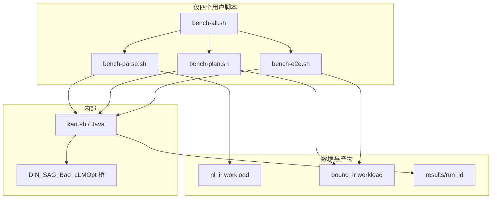

# KART 对比实验规范（Experiment）

- 版本：v0.2，2026-09-25
- 状态：规范已锁定；benchmark 脚本与桥接实现已部分落地。真实性、公平性和可运行性以 [`docs/comparative-experiment-readiness-2026-09-25.md`](../docs/comparative-experiment-readiness-2026-09-25.md) 的审计门禁为准，未通过门禁的结果不得作为正式主表结论。
- 上游：`spec/design.md`、`spec/IMPLEMENTATION_PLAN.md` §19、`docs/environment-lock.md`
- 数据与用例参考：`experiments/workloads/tdrive_smoke.json`、`docs/easy_query_example.md`

---

## 1. 目标与假设

### 1.1 目标

在同一 T-Drive 快照与同一 HBase 环境下，分三块对比：

1. **LLM → IR**：正确率与解析速度（相对开源 Text-to-SQL / Text-to-NoSQL 方法移植）
2. **逻辑计划生成→选择**：规划全流程速度（相对开源计划优化设计移植）
3. **端到端执行**：从 BoundIR 起的正确性与 latency（本系统 vs HBase 原生 FullScan vs RBO vs CBO）

### 1.2 假设与限制

- 语义：`OBSERVED_POINT`；时间半开区间；空间闭矩形；相似度量按 design 文档
- 存储：单节点伪分布式 HBase（见 environment-lock）；**结论只报相对优劣，不外推多 RegionServer**
- Manifest：实验期间固定（默认 `tdrive_v1_ready`），写入每次 `meta.json`
- **未开源方法不进入实验臂**（见 §2）
- 外部方法：**以开源代码为主**，论文仅用于补齐「输出改为 DraftIR / PlanEnvelope」的最小改动；禁止用改自家 prompt 冒充外部方法

### 1.3 数据流总约定

```text
E1: 冻结 NL  → 各臂 → DraftIR/BoundIR + 对错 + t_parse
E2: 金标 BoundIR → 各臂 → SafePlan + t_plan（生成开始→选择结束）
E3: 金标 BoundIR → 各臂 → 查询结果 + t_e2e（BoundIR 之后起算；含 t_plan+t_exec）
```

- E2/E3 **默认使用金标 BoundIR**，不把 E1 模型输出直接喂进 E3 主表（避免解析误差污染延迟）
- 可选附录：E1 成功子集做「真实 NL 管道」误差分解，**不进 E3 主 latency 表**

---

## 2. 开源清单与排除项

### 2.1 进入实验的开源依据（实现时冻结 commit 写入 meta）

| 用途 | 项目 | 地址 | 必读入口 |
|---|---|---|---|
| DIN-SQL（Spider 流） | Few-shot-NL2SQL-with-prompting | https://github.com/MohammadrezaPourreza/Few-shot-NL2SQL-with-prompting | `DIN-SQL.py` |
| DIN-SQL（BIRD 流） | 同上 | 同上 | `DIN-SQL_BIRD.py` |
| Text-to-NoSQL / SAG | TEND + SAG | https://github.com/Jinwei-Lu/Text-to-NoSQL | `src/tend/solver/sag/`；CLI `tend solve` |
| Bao | BaoForPostgreSQL | https://github.com/learnedsystems/BaoForPostgreSQL | `bao_server/` 选臂逻辑；文档 https://rmarcus.info/bao_docs/ |
| LLMOpt | LLMOpt | https://github.com/lucifer12346/LLMOpt | Generator + Selector 脚本；相关 hint 插件 https://github.com/lucifer12346/pg_hint_plan_lucifer |

建议目录：`experiments/third_party/<name>/`，`meta.json` 字段示例：

```json
"third_party": {
  "din_sql": { "url": "...", "commit": "<sha>" },
  "text_to_nosql": { "url": "...", "commit": "<sha>" },
  "bao": { "url": "...", "commit": "<sha>" },
  "llmopt": { "url": "...", "commit": "<sha>" }
}
```

### 2.2 明确排除（不进实验臂）

| 名称 | 原因 |
|---|---|
| **SMART**（TEND 文早期四步框架） | 现官方仓库维护的是 **SAG**，无独立 SMART 开源实现 |
| **LLM-QO**（arXiv:2502.05562） | 未找到公开代码与权重 |
| 用 Spider/BIRD/TEND **公开榜数字**与本实验横比 | 数据集与目标语言不同，不可比 |

Related Work 可提及上述工作，但不得作为可运行对比臂。

---

## 3. 整体架构与脚本入口

### 3.1 架构



### 3.2 用户可见入口（仅此四个，不多不少）

| # | 脚本 | 作用 |
|---|---|---|
| 1 | `scripts/bench-parse.sh` | **LLM → IR** 对比 |
| 2 | `scripts/bench-plan.sh` | **逻辑计划生成→选择** 对比 |
| 3 | `scripts/bench-e2e.sh` | **端到端** 对比 |
| 4 | `scripts/bench-all.sh` | **综合**：依次执行 1→2→3 |

脚本内部可调用 `kart.sh`、Python 桥等；规范与文档**只承诺**上述四个入口。

### 3.3 参数

脚本 **1 / 2 / 3** 必须支持：

| 参数 | 含义 | 默认 |
|---|---|---|
| `--arm <list\|all>` | 参加对比的方法，逗号分隔 | `all` |
| `--workload <path>` | workload JSON | 见各实验默认路径 |
| `--run-id <id>` | 结果目录名 | 必填或自动生成时间戳 |
| `--trials <n>` | 覆盖 suite 的重复次数；cold 正式首轮建议 1，warm P50/P95 建议至少 5 | suite 默认值 |

脚本 **3** 额外：

| 参数 | 含义 | 默认 |
|---|---|---|
| `--cache cold\|warm` | 缓存协议 | `cold`（主表）；可另跑 `warm` |

脚本 **4** 透传 / 分段指定：

| 参数 | 含义 |
|---|---|
| `--run-id` | 三实验共用 |
| `--parse-arm` / `--plan-arm` / `--e2e-arm` | 覆盖各段 `--arm`；缺省则各段 `all` |
| `--parse-workload` / `--plan-workload` / `--e2e-workload` | 可选覆盖 |

**`--arm` 合法值：**

- 脚本1：`kart`, `din-spider`, `din-bird`, `sag`
- 脚本2：`bao`, `llmopt`, `kart`
- 脚本3：`fullscan`, `rbo`, `cbo`, `kart`

### 3.4 调用示例

```bash
cd /home/jaytang/projects/llm-kv   # 或文档约定的 WSL 工作目录
./scripts/bench-parse.sh --arm kart,sag --run-id r1
./scripts/bench-plan.sh  --arm bao,kart --run-id r1
./scripts/bench-e2e.sh   --arm fullscan,cbo,kart --run-id r1 --cache cold
./scripts/bench-all.sh   --run-id r1
./scripts/bench-all.sh   --run-id r1 \
  --parse-arm kart,din-spider,din-bird,sag \
  --plan-arm all \
  --e2e-arm fullscan,rbo,cbo,kart
```

### 3.5 结果目录

```text
experiments/results/<run_id>/
  meta.json          # 环境、manifest、LLM、third_party commits、arms、cache
  parse.jsonl        # E1 每行一条 (query_id, arm, ...)
  plan.jsonl         # E2
  e2e.jsonl          # E3
  summary.md         # 汇总表（可由 report 步骤生成）
```

---

## 4. Workload 与 Oracle

### 4.1 文件约定（实现阶段落地；规范先定名）

| 文件 | 用于 | 内容 |
|---|---|---|
| `experiments/workloads/nl_ir_v1.json` | E1 | 冻结 NL；金标 BoundIR 或期望 `UNSUPPORTED` / 澄清类标签；查询类型分层 |
| `experiments/workloads/bound_ir_v1.json` | E2、E3 | 冻结 BoundIR；可从 `tdrive_smoke.json` 扩展；含选择率分层与「RBO 易错」样例 |
| `experiments/workloads/*.oracle.json` | 正确性 | FullScan Oracle 缓存的轨迹 ID / Top-K 有序列表 |

现有 smoke / docs 用例作为种子；正式实验前冻结版本号写入 meta。

### 4.2 分层建议

- 谓词：仅 T / 仅 Z / 仅 H / TZ / 组合 / Top-K（DTW 等）
- 选择率：小窗 / 大窗
- E1 另含拒绝类（COUNT、连续路径、未知 metric、未注册地名等）

### 4.3 Oracle

- 真值：FullScan + ExactFilter（与 design §11/§13 一致）
- Top-K：有序列表相等（含 tie_breaker）
- 失败（超时、`RESOURCE_EXHAUSTED`、非法计划）：单独计数；**主延迟统计在成功子集上计算**，并披露失败率

### 4.4 JSONL 行字段（最小集）

**E1 `parse.jsonl`：**

`run_id, query_id, arm, ok_ex, ok_ir_valid, reject_expected, reject_actual, t_parse_ms, llm_calls, tokens_in, tokens_out, error`

**E2 `plan.jsonl`：**

`run_id, query_id, arm, plan_ok, plan_id, t_plan_ms, llm_calls, tokens_in, tokens_out, n_candidates, n_validation_reject, error`

**E3 `e2e.jsonl`：**

`run_id, query_id, arm, ok_oracle, t_e2e_ms, t_plan_ms, t_exec_ms, n_ranges, index_rows, fetch_chunks, bytes, dtw_cells, error`

重复次数：每 (query, arm) 建议 ≥3，报 P50/P95（实现可写入多行 `trial` 字段）。

---

## 5. 实验一：LLM → IR

### 5.1 研究问题

同一冻结 NL 与同一 DraftIR/BoundIR Schema 下，各开源方法移植臂相对 KART 的 **Execution Accuracy** 与 **`t_parse`**。

### 5.2 对比臂

| `--arm` | 来源 | 操作化 |
|---|---|---|
| `kart` | 本系统 | NL→DraftIR（schema 校验与有限重试）→Binder；**主表默认单轮无澄清**；澄清协议另表附录 |
| `din-spider` | 官方 `DIN-SQL.py` | 保留：schema linking → 复杂度分类 → 分档生成 → self-correction；将「库表/SQL」替换为 **逻辑目录 + DraftIR JSON Schema**；解析输出为 DraftIR |
| `din-bird` | 官方 `DIN-SQL_BIRD.py` | 同上；BIRD 式 external knowledge 映射为 **固定** 目录文本（regions、语义说明等），禁止临时加料 |
| `sag` | Text-to-NoSQL `sag/` | 移植：grounding / 路径卡片思想 → 候选生成 → 对齐或校验反馈修复 → 多候选择优；**不启动 Mongo**；反馈用 Schema/Binder 错误与（可选）Oracle |

### 5.3 论文要点（实现对照用）

- **DIN-SQL**（Pourreza & Rafiei, NeurIPS 2023；arXiv:2304.11015）：分解 in-context learning + self-correction；官方仓提供 Spider / BIRD 两套脚本。
- **TEND / SAG**（Lu et al., arXiv:2502.11201；仓库 README 称 ICDE 2027）：Text-to-NoSQL；当前公开参考求解器为 **SAG**（Schema-as-Data Grounding），非早期文中的 SMART 四步独立代码。

### 5.4 必读 / 故意不移植

| 臂 | 必读 | 故意不移植 |
|---|---|---|
| din-* | 官方脚本中的模块顺序与 prompt 结构 | Spider/BIRD 原库、原 SQL 执行器 |
| sag | `src/tend/solver/sag/` 主流程与候选/反馈结构 | MongoDB witness、TEND 原 EXC 榜、QueryCraft UI |

### 5.5 指标

- **正确率（主）**：EX = Binder 成功后 `query-ir` 结果 ≡ Oracle；合法 IR 率；拒绝准确率
- **速度**：`t_parse`（至 BoundIR 或明确失败）、LLM calls、tokens
- 附录：字段级 temporal/spatial/predicates/similarity

### 5.6 公平性

- 同一 `LLM_MODEL` / `temperature=0`（或各臂论文要求的采样设置，写入 meta）
- 同一逻辑目录与 Schema 版本
- 禁止与公开 Text-to-SQL/NoSQL 榜数字横比

---

## 6. 实验二：逻辑计划生成 → 选择

### 6.1 研究问题

同一金标 BoundIR 下，各开源优化器设计移植臂完成 **「生成计划 → 选择最终 SafePlan」** 的耗时 `t_plan`。

> 有验证器时查询结果正确率对计划臂无区分度；计划质量由实验三的 `t_exec` / `t_e2e` 体现。本实验**不把 Oracle 一致率作为对比主指标**。

### 6.2 对比臂

| `--arm` | 来源 | 操作化 |
|---|---|---|
| `bao` | BaoForPostgreSQL | 将本系统有限计划族（如 `P_T`/`P_Z`/`P_H`/`P_TZ`/…）视为 hint/臂；按 Bao 的选臂思路选一臂即止；**不安装 PostgreSQL 扩展** |
| `llmopt` | LLMOpt | **G**：生成候选计划（或等价 hint 列表）→ **S**：选择最终计划；整段计入 `t_plan`；输出经本系统验证器 |
| `kart` | 本系统 | `LlmProposalPolicy` 动作搜索 + 验证器 + Cost 选择 |

### 6.3 论文要点

- **Bao**（Marcus et al., SIGMOD 2021）：在有限 hint 集合上引导已有优化器，而非从零生成完整计划树。
- **LLMOpt**（arXiv:2503.06902）：LLM 作为 Generator 与/或 Selector；开源含训练与推理脚本。

### 6.4 必读 / 故意不移植

| 臂 | 必读 | 故意不移植 |
|---|---|---|
| bao | `bao_server` 选臂/奖励思路 | PG C 扩展、IMDb/JOB 原实验栈 |
| llmopt | G/S 推理脚本的输入输出协议 | 必须依赖的 PG/`pg_hint_plan` 执行引擎（本系统用自有验证器+执行器落地） |

### 6.5 指标

- **主**：`t_plan` P50/P95（生成开始 → 选出最终 SafePlan）
- **辅**：LLM calls/tokens、候选数、验证拒绝次数、合法计划产出率（可用性门禁）

### 6.6 公平性

- 同一 BoundIR、同一 SearchBudget 上限（写入 meta）
- 同一 Cost 系数与 manifest；LLM 臂同一 API 端点

---

## 7. 实验三：端到端（BoundIR 之后）

### 7.1 研究问题

金标 BoundIR 固定后，四臂在完整「规划 + 执行」上的 **Oracle 一致率** 与 **latency**。

### 7.2 延迟起止

```text
t_e2e 起点 = BoundIR 已就绪（NL / LLM→IR 不计）
t_e2e 终点 = 返回轨迹 ID 列表或 Top-K
可分解：t_plan + t_exec
```

### 7.3 对比臂

| `--arm` | 定义 |
|---|---|
| `fullscan` | **HBase 原生语义基线**：固定 `P_FULL` = `traj_raw` FullScan + 客户端 ExactFilter（无二级索引访问路径、无候选搜索） |
| `rbo` | 固定公开规则 `TZ → T → Z → H → FULL` 映射到一个计划模板（无候选搜索、无代价枚举选优） |
| `cbo` | 生成多个 SafePlan + **CostModel** 选 `estimated_ms` 最小（**无 LLM**） |
| `kart` | 与 E2 臂 `kart` 相同的规划策略 + 同一执行器 |

说明：HBase 无轨迹查询语言；`fullscan` 是规范的「仅用主表扫描」基线，不是 HBase Shell 随意 get。

### 7.4 指标

- **正确性**：与 Oracle 一致率（集合 / Top-K 有序）
- **Latency**：`t_e2e`、`t_plan`、`t_exec` 的 P50/P95；相对 `fullscan` 的加速比
- **辅助（解释延迟）**：扫描 ranges、索引行、回表 chunk、bytes、`dtw_cells`

### 7.5 Workload / 控制

- 与 E2 同一 `bound_ir_v1.json`；含选择率分层与 RBO 易错查询
- 同 manifest、同执行器、同 batch/线程池；唯一自变量为计划如何得到
- `--cache cold|warm` 分报；主结论建议以 cold 为准并披露协议
- FullScan 可设统一超时；超时记失败并披露

### 7.6 索引成本附录（建议）

相对 `fullscan`，至少附录：索引表体积、构建/校验时间，避免只报查询加速。

---

## 8. 环境与复现元数据

每次 run 的 `meta.json` 至少包含：

- `manifest_id`、`semantics_version`、`git_commit`（本仓库）
- JDK / HBase client·server / ZK（对齐 `docs/environment-lock.md`）
- `LLM_BASE_URL`、`LLM_MODEL`（无密钥）
- `third_party.*.commit`
- `arms`、`workload` 路径与校验和、`cache`、`trials`
- `cost.calibrated`（来自 `config/planner.yaml`）

工作目录：WSL 内 `/home/jaytang/projects/llm-kv`（或文档当前约定路径）；HBase/`kart.sh up` 就绪后再跑 E3。

---

## 9. 公平性总则

1. 同一快照与表布局；禁止一侧开启对方没有的隐藏加速（未文档化的缓存预热等）
2. 外部臂必须可追溯到 §2 开源 commit + 本文移植说明
3. E1 与 E3 延迟边界不得混用
4. 主表成功子集统计 + 失败率披露
5. 单节点结论不得写成集群结论

---

## 10. 不做项

- 实现或对比 **SMART**、**LLM-QO** 实验臂
- 将 NL 解析时间计入 E3 `t_e2e`
- 与 Spider / BIRD / TEND 公开榜数字直接横比
- GeoMesa / DITA 等跨引擎主对比（可未来扩展）
- 多节点扩展实验
- 本规范不把“脚本能够启动”视为公平性通过；四个 `bench-*.sh` 即使存在，也必须先通过 readiness audit 的 arm 语义、计时、缓存和 Oracle 门禁。

---

## 11. 实现阶段建议顺序

1. E3 四臂（本系统能力最近）+ `bench-e2e.sh`
2. E1 `kart` + `din-spider` / `din-bird` 桥 + `bench-parse.sh`
3. E1 `sag` 桥
4. E2 `bao` / `llmopt` / `kart` + `bench-plan.sh`
5. `bench-all.sh` 串联与 `summary` 汇总

当前实现状态和剩余工作不在本规范中猜测，以 `docs/comparative-experiment-readiness-2026-09-25.md` 为准。

---

## 12. 参考文献

1. Pourreza, M., Rafiei, D. *DIN-SQL: Decomposed In-Context Learning of Text-to-SQL with Self-Correction*. NeurIPS 2023. arXiv:2304.11015. Code: https://github.com/MohammadrezaPourreza/Few-shot-NL2SQL-with-prompting
2. Lu, J., et al. *Bridging the Gap: Enabling Natural Language Queries for NoSQL Databases through Text-to-NoSQL Translation*. arXiv:2502.11201. Code: https://github.com/Jinwei-Lu/Text-to-NoSQL （公开求解器：SAG）
3. Marcus, R., et al. *Bao: Making Learned Query Optimization Practical*. SIGMOD 2021. Code: https://github.com/learnedsystems/BaoForPostgreSQL
4. *LLMOpt: A Query Optimization Method Utilizing Large Language Models*. arXiv:2503.06902. Code: https://github.com/lucifer12346/LLMOpt
5. Yu, T., et al. *Spider: A Large-Scale Human-Labeled Dataset for Complex and Cross-Domain Semantic Parsing and Text-to-SQL Task*. EMNLP 2018.（基准参考，不直接跑榜）
6. Li, J., et al. *Can LLM Already Serve as A Database Interface? A BIg Bench for Large-Scale Database Grounded Text-to-SQLs (BIRD)*. NeurIPS 2023. arXiv:2305.03111.（基准参考，不直接跑榜）

---

## 13. 与需求/设计文档的关系

- MVP 需求曾关闭「完整基线论文实验」（OI-7）；本文是 **MVP 之后的对比实验规范**，不改变线上正确性门禁（结果须与 Oracle 一致）
- 计划搜索、验证器、代价模型行为以 `spec/design.md` 为准；本文只定义对比臂与测量边界
- 规划侧内部消融（leave-one-out）见 [`spec/ablation_experiment.md`](ablation_experiment.md)，与本文正交，不把对比臂列入消融
