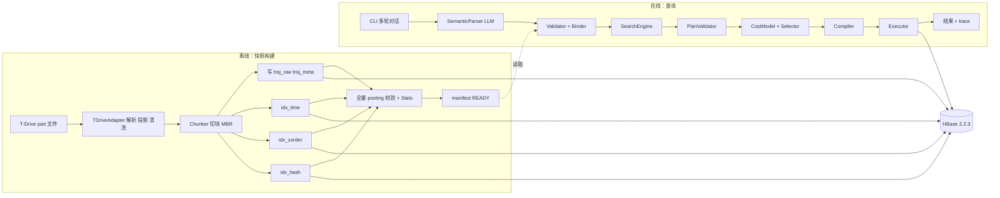
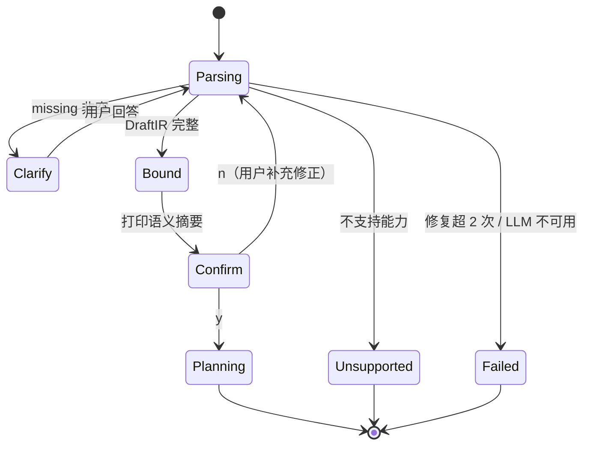

# KART 设计文档（Design）

- 版本：v0.1，2026-09-21；状态栏更新 2026-09-25
- 上游：`spec/requirement.md`（需求）、`spec/IMPLEMENTATION_PLAN.md`（完整方案，本文只写 MVP 落地所需的部分，并记录与其不同之处）
- 下游：`spec/task.md`
- 约定：本文所有参数为**开发默认值**，全部可配置；运行环境与依赖冲突处理见 `docs/environment-lock.md`（OI-8 **已关闭**）。

---

## 1. 运行环境与版本锁定

| 组件 | 版本 / 位置 | 备注 |
|---|---|---|
| HBase Server | 2.2.3，`F:\envs\hbase-2.2.3`（WSL 内路径由用户挂载） | 伪分布式单节点，`hbase.cluster.distributed=true`，`hbase.rootdir=file:///home/jaytang/hbase/data`，`HBASE_MANAGES_ZK=false` |
| ZooKeeper | 3.4.10，`localhost:2181` | 外置，`dataDir=/home/jaytang/zookeeper/data` |
| JDK | OpenJDK 8（`/usr/lib/jvm/java-8-openjdk-amd64`） | 项目 `maven.compiler.source/target=1.8` |
| WSL | Ubuntu-22.04 (WSL2) | Java 应用在此运行；代码路径 `/mnt/f/Projects/LLM_KV` |
| Maven | 3.6+（WSL 内；见 `docs/environment-lock.md`） | 建议 `~/.m2` 放在 WSL 本地盘而非 `/mnt/f`，避免 IO 慢 |

与 IMPLEMENTATION_PLAN.md 的差异：文档建议 JDK 11 + HBase 2.5，实际锁定 **Java 8 + HBase 2.2.3**。影响：不可使用 `java.net.http`、`var`、`record`、`switch` 表达式；依赖库需选择 Java 8 兼容版本。

### 1.1 Maven 依赖（已落地；版本见 `docs/environment-lock.md`）

| 用途 | 依赖 | 说明 |
|---|---|---|
| HBase 客户端 | `org.apache.hbase:hbase-client:2.2.3` | 与服务端同版本；Guava/Netty 冲突处理见 OI-8（**已关闭**，`docs/environment-lock.md`） |
| JSON | `com.fasterxml.jackson.core:jackson-databind` 2.x | Java 8 兼容 |
| JSON Schema | `com.networknt:json-schema-validator` | 选择支持 Java 8 的版本 |
| CLI | `info.picocli:picocli` 4.x | 子命令、参数解析 |
| 投影 | `org.locationtech.proj4j:proj4j` + `proj4j-epsg` | WGS84 → EPSG:32650 |
| 哈希 | `commons-codec` ≥1.13 `MurmurHash3.hash128x64` | 稳定 128 位哈希，记录 `hash_version=murmur3_x64_128` |
| YAML 配置 | `jackson-dataformat-yaml` | 配置文件 |
| HTTP（LLM） | JDK `HttpURLConnection` | 零依赖；如需连接池再考虑 OkHttp 4 |
| 测试 | JUnit 5、`net.jqwik:jqwik`（性质测试） | Java 8 兼容 |
| 日志 | SLF4J + Logback | 与 hbase-client 的 log4j 桥接需处理 |

### 1.2 启动方式

- `scripts/kart.sh`（WSL）：统一入口；底层 `java -jar target/kart.jar <subcommand>`，读取 `config/environment.yaml` 与环境变量。
- `hbase-site.xml` 客户端侧只需 `hbase.zookeeper.quorum=localhost`、`clientPort=2181`，放在 `config/hbase/`，通过 classpath 或 `Configuration.addResource` 加载。
- 环境变量：`LLM_BASE_URL`、`LLM_MODEL`、`LLM_API_KEY`（OI-1 **已关闭**：DeepSeek；见 `docs/environment-lock.md`）。

---

## 2. 总体架构



单进程、单 Maven 模块，包结构见第 12 节。

---

## 3. 数据模型

### 3.1 T-Drive 输入格式

```
<taxiId>-<segmentId>-MULTIPOINT Z((lon lat t_ms), (lon lat t_ms), ...)
```

解析规则：

- 以第一个 `-MULTIPOINT Z(` 之前的部分为 `trajectory_id`（外部 ID，原样保存），其中第一个 `-` 前为 `vehicle_id`。
- 括号内以 `), (` 切分点，每点三个以空格分隔的数值：lon、lat、epoch_ms。
- 任一字段解析失败 → 整条轨迹进入拒绝报告（`REJECT_PARSE`），不部分保留。

### 3.2 规范化点（CanonicalPoint）

```
vehicle_id      String        原始出租车 ID
trajectory_id   String        原始 "taxiId-segmentId"
tid             uint64        快照内轨迹 ID，按 trajectory_id 字典序从 1 递增分配
seq             uint32        轨迹内点序号（排序去重后）
timestamp_ms    int64         UTC 毫秒
x_m, y_m        double        UTM 50N 米制坐标
```

清洗顺序（每步输出计数写入 build 报告）：

1. 解析 → 2. 投影（Proj4J，EPSG:4326 → EPSG:32650）→ 3. 轨迹内按 t 排序 → 4. 删除完全重复点（t,x,y 全等）→ 5. 同 t 不同位置保留首个 → 6. 分配 seq → 7. 域检查（点在空间域外 → 轨迹标记 `REJECT_OUT_OF_DOMAIN`，不 clamp）→ 8. 空轨迹拒绝。

**不做** gap-session 重切分（假设 A1）。

### 3.3 空间域与时间 epoch

- 空间域 `[xmin,xmax]×[ymin,ymax]`：`profile-data` 对全量数据计算 min/max 后向外各扩 1 km，写入 manifest。域外点的处理策略在 profile 后确定（OI-9）；默认拒绝整条轨迹。
- 时间 epoch：`floor(min(timestamp_ms) / bucket_ms) * bucket_ms`，写入 manifest，保证桶号非负。

### 3.4 Chunk

```
tid, chunk_id(uint32, 轨迹内从 0 递增)
seq_first, seq_last, point_count
t_min_ms, t_max_ms
min_x, min_y, max_x, max_y
points[]  编码：point_count × (int64 t, double x, double y) 大端，前缀 uint32 count
```

- 每块最多 **256** 个点；MVP 无 halo（`halo_policy=NONE`）。
- 完整轨迹重建 = 按 chunk_id 顺序拼接。

---

## 4. HBase 表与 RowKey 编码

### 4.1 编码原语

- `U8/U32/U64`：无符号大端定宽。
- `shard(tid) = tid mod S`，S=4。
- `raw_key = U8(shard) || U64(tid) || U32(chunk_id)`（13 字节）。
- `prefixSuccessor(P)`：从右向左找首个非 0xFF 字节加一并截断；全 0xFF 返回 `Optional.empty()`，调用方改用"无 stopRow + 前缀过滤"或报错。
- Scan 均为 `[startRow, stopRow)`；`Scan.withStartRow(start, true).withStopRow(stop, false)`（hbase-client 2.2 API）。

### 4.2 表定义（表名含版本后缀 `_v1`，列族单一 `d`）

| 表 | RowKey | 列 | 说明 |
|---|---|---|---|
| `traj_raw_v1` | `U8 shard ‖ U64 tid ‖ U32 chunk` | `d:p` 点载荷；`d:m` 元数据（t_min,t_max,MBR,seq_first,seq_last,count） | 主表 |
| `traj_meta_v1` | `U8 shard ‖ U64 tid` | `d:ext` trajectory_id；`d:veh` vehicle_id；`d:cc` chunk_count；`d:pc` point_count；`d:t0`,`d:t1` | 轨迹级元数据 |
| `idx_time_v1` | `U8 shard ‖ U64 bucket ‖ U64 tid ‖ U32 chunk` | `d:r` raw_key | 时间 posting |
| `idx_zorder_v1` | `U8 shard ‖ U64 z_cell ‖ U64 tid ‖ U32 chunk` | `d:r` raw_key | 空间 posting |
| `idx_hash_v1` | `U8 shard ‖ U8 field_tag ‖ 16B hash128 ‖ U64 tid ‖ U32 chunk` | `d:r` raw_key；`d:v` 原值 | vehicle_id 等值 posting，`field_tag=0x01` |
| `kart_catalog` | `manifest_id` 字符串 | `d:json` manifest JSON | 目录表（也可落文件，MVP 选一种） |

预分区：每表按 shard 前缀 `0x00..0x03` 预建 4 个 Region（`createTable(desc, splitKeys)`），使单节点也有多 Region 供后续观察。

### 4.3 时间索引

- 桶宽 `bucket_ms = 600_000`（10 min）。
- 块写入桶 `b(t_min) .. b(t_max)` 全部。
- 查询 `[a,b)`：枚举 `b(a) .. b(b-1)`，每个 shard 一条 Scan：`start = U8(s)‖U64(b_lo)`，`stop = U8(s)‖U64(b_hi+1)`；结果按 (tid,chunk) 去重。

### 4.4 Z-order 索引

- 层级 L=8，每轴 256 单元，单元边长 `(xmax-xmin)/256`（北京约 70 km 域 → ~300 m）。
- 量化 `cx = min(255, floor((x - xmin)/cell_w))`，`cy` 同理；`z = interleave(cx, cy)`（cx 占偶数位，cy 占奇数位）。
- 块写入其 MBR 相交的全部单元 `[cx_min..cx_max]×[cy_min..cy_max]`。
- 查询矩形 → 单元范围 → 确定性四叉递归：完全覆盖的子树输出连续 Morton 区间；合并相邻区间；区间数超 `max_ranges=64` 时合并为更宽区间（**不截断**）。
- 每 shard、每区间一条 Scan：`start = U8(s)‖U64(z_lo)`，`stop = U8(s)‖U64(z_hi+1)`。
- 精确阶段用原始点坐标判定，去除假阳性。

### 4.5 Hash 索引

- `hash128 = MurmurHash3.hash128x64(utf8(vehicle_id))`，记录 `hash_version`。
- 查询：每 shard 一条 Scan 前缀 `U8(s)‖0x01‖hash128`，读 `d:v` 核对原值相等（应对碰撞）。

### 4.6 构建与发布协议

```
BUILDING manifest 写入
→ 写 raw/meta → 写三张索引 → 生成 stats
→ verify：对每块重算期望 posting 并 Get 核对；对每张索引 Scan 全表核对无多余键
→ manifest.status = READY
```

READY 后禁止写入；每次查询开始时读取一次 manifest 并固定。

### 4.7 Manifest 字段

```json
{
  "manifest_id": "tdrive_v1_ready",
  "status": "READY",
  "dataset": {"source": "datasets/tdrive/part-*", "checksum": "...", "assumptions": ["A1","A2","A3"]},
  "layout": {"shard_count": 4, "chunk_max_points": 256, "bucket_ms": 600000, "epoch_ms": 0,
             "zorder_level": 8, "domain": {"xmin":0,"xmax":0,"ymin":0,"ymax":0}, "crs": "EPSG:32650",
             "hash_version": "murmur3_x64_128", "tables": {"raw":"traj_raw_v1", "...":"..."}},
  "semantics_version": "point_dtw_v1",
  "stats_version": "stats_v1",
  "build_report": {"trajectories": 0, "points": 0, "rejected": {"parse":0,"out_of_domain":0,"empty":0}, "dedup_removed": 0},
  "tid_map_location": "traj_meta_v1"
}
```

---

## 5. Typed IR

### 5.1 分层

- `DraftIR`：LLM 输出，允许字段缺失，附 `sources`（每字段来源文本片段）与 `missing[]`。
- `BoundIR`：Binder 输出，无缺失，时间为 epoch_ms，空间为米制矩形，参考轨迹为 tid，含 `snapshot`。
- 两者共用字段名，Schema 分别为 `schemas/draft-ir.schema.json`、`schemas/bound-ir.schema.json`，`additionalProperties=false`，枚举字段用 enum。

### 5.2 字段

| 字段 | DraftIR | BoundIR |
|---|---|---|
| `ir_version` | "1.0" | 同 |
| `source.dataset_id` | 字符串 | 必须在目录中 |
| `temporal` | `{start,end}` ISO 字符串或缺失 | `{start_ms,end_ms}`，start<end |
| `spatial` | `{geometry:{type:RECTANGLE, min_lon,min_lat,max_lon,max_lat}}` 或 `{region_name}` 或缺失 | `{min_x,min_y,max_x,max_y}` 米制，`relation:INTERSECTS`，`boundary:INCLUDED` |
| `predicates[]` | `{field:"vehicle_id", op:"EQ", value}` | 同，field 必须在 schema 中 |
| `semantics` | 固定 `{mode:OBSERVED_POINT, coupling:SAME_POINT}` | 同 |
| `similarity` | `{metric, reference_trajectory_id, exclude_reference}` 或空 | `{metric:DTW, reference_tid, scope:FULL_TRAJECTORY, exclude_reference, local_distance:EUCLIDEAN, normalization:NONE}` |
| `result` | `{mode: TRAJECTORY_IDS \| TOP_K, k?}` | 同，TOP_K 时 k ≥ 1，`tie_breaker:TID_ASC` |
| `snapshot` | 不允许出现 | `{manifest_id, semantics_version}` 由系统注入 |

### 5.3 跨字段规则（Binder 校验）

- 无任何谓词（temporal/spatial/predicates 全空）且非 Top-K → 拒绝（避免全库返回）；Top-K 且无谓词 → 拒绝（"不默认全库相似检索"）。
- `TOP_K` 必须有 similarity；`TRAJECTORY_IDS` 必须无 similarity。
- 支持 `metric ∈ {DTW, FRECHET, HAUSDORFF}`；其他 → UNSUPPORTED_QUERY（不静默替换）。
- 参考轨迹 ID 在 `traj_meta` 中不存在 → 明确错误，不猜。
- 经纬度矩形与数据域求交为空 → 合法，返回空结果。
- IR 任何层级出现 `startRow/stopRow/table/region/rowkey` 等键 → 拒绝。

---

## 6. 自然语言解析与多轮澄清（CLI 协议）

### 6.1 LLM 网关

```java
interface LlmClient {
    LlmResponse chat(List<Message> messages, JsonNode responseSchemaHint, LlmOptions opts);
}
class OpenAiCompatibleClient implements LlmClient  // POST {LLM_BASE_URL}/chat/completions
class MockLlmClient implements LlmClient           // 从 testdata/llm-mock/*.json 按输入 hash 取固定回复
```

- 请求体：`model`、`messages`、`temperature=0`、可选 `response_format={"type":"json_object"}`（OI-1：是否支持在首次接入时探测，不支持则退化为提示词约束 + 抽取首个 JSON 块）。
- 记录每次调用：model、prompt tokens、completion tokens、延迟、原始输出。
- 超时默认 30 s，单查询最大调用数见第 8 节预算。

### 6.2 解析流程

```
用户 NL + 会话上下文（已知：数据集、时区、已注册区域、之前回答）
→ System prompt：逻辑目录（字段、四类查询、语义说明、DraftIR Schema 摘要、示例）
→ LLM 返回 DraftIR JSON
→ Schema 校验；失败则附错误重试（≤2 次）
→ 缺失检测：temporal 需要日期？spatial 需要矩形/区域？TOP_K 需要 reference/k？
→ 若 missing 非空：CLI 打印问题（一次列出全部缺项），读取用户回答，追加到会话上下文，回到第一步
→ Binder → BoundIR → 打印语义摘要，用户确认（y/n）→ 规划
```

CLI 对话状态机：



- 澄清轮数上限 3；超过返回 NEED_CLARIFICATION 及剩余问题后退出。
- 区域名称：MVP 只识别 `config/regions.yaml` 中预注册的名称 → 经纬度矩形；未注册的名称进入澄清（OI-10）。

---

## 7. 算子、逻辑计划与物理计划

### 7.1 算子（MVP 子集）

| op | 输入 → 输出 | 物理实现 |
|---|---|---|
| `TIME_RANGE_SCAN` | → ChunkRefSet | idx_time 全 shard 桶区间 Scan |
| `ZORDER_RANGE_SCAN` | → ChunkRefSet | idx_zorder 全 shard Morton 区间 Scan |
| `EQUALITY_LOOKUP` | → ChunkRefSet | idx_hash 全 shard 前缀 Scan + 原值核对 |
| `FULL_SCAN_CHUNKS` | → ChunkBatch | traj_raw 全表 Scan（兜底/Oracle） |
| `INTERSECT` / `UNION` / `DEDUPLICATE` | ChunkRefSet → ChunkRefSet | 内存 HashSet，键 (tid,chunk) |
| `FETCH_TRAJECTORY_CHUNK` | ChunkRefSet → ChunkBatch | `Table.get(List<Get>)` 按 shard 分批（batch=500） |
| `EXACT_ST_FILTER` | ChunkBatch → MatchedChunk | 逐点检查全部 IR 谓词 |
| `PROJECT_TRAJECTORY_IDS` | MatchedChunk → TrajectoryIds | tid 去重 |
| `EXCLUDE_REFERENCE` | TrajectoryIds → TrajectoryIds | 删 reference_tid |
| `BATCH_GET_TRAJECTORY` | TrajectoryIds → Trajectory | meta Get 得 chunk_count → 全部块 Get；复用已读块 |
| `SIMILARITY` | Trajectory → ScoredTraj | DTW O(mn)，滚动数组 |
| `TOP_K` | ScoredTraj → 有序结果 | 全部评分后堆取 K，tie 按 tid |
| `RETURN_TRAJECTORY_IDS` | TrajectoryIds → 结果 | 按 tid 升序，映射回外部 trajectory_id |

Quadtree 算子不在 MVP。

### 7.2 PlanEnvelope（逻辑计划 JSON）

沿用 IMPLEMENTATION_PLAN.md 第 10.1 节格式：`plan_id, query_id, manifest_id, root, nodes[{id, op, inputs[], params}]`，`params.predicate_ref` 用 JSON Pointer 指向 IR（`/temporal`、`/spatial`、`/predicates/0`）。Schema：`schemas/plan.schema.json`。

MVP 候选计划族（由构造器生成，非 LLM 手写）：

- `P_T`：TIME_RANGE_SCAN → 后缀
- `P_Z`：ZORDER_RANGE_SCAN → 后缀
- `P_H`：EQUALITY_LOOKUP → 后缀（仅当有 vehicle_id 谓词）
- `P_TZ` / `P_TH` / `P_ZH` / `P_TZH`：两/三路 INTERSECT → 后缀
- `P_FULL`：FULL_SCAN_CHUNKS → EXACT_ST_FILTER → 后缀（兜底）

### 7.3 PhysicalPlan

```
query_hash, manifest_id, layout_hash, compiler_version
scan_tasks[]: {table, start_row(hex), stop_row(hex), columns, caching, source_node_id, shard, coverage_ref}
fetch_spec: {table, batch_size}
local_dag: 逻辑 DAG 引用
```

只有编译器产生字节；`explain` 以十六进制展示，不允许外部输入。

---

## 8. 计划搜索

### 8.1 状态与动作

```
SearchState { access_subgraph, used_indexes, obligations(未覆盖谓词), merge_impl, partition_kind, fast_cost, signature }
LegalAction  { action_id, kind: START | INTERSECT | REPLACE | CHOOSE_MERGE | PARTITION_UNION | FINISH, ... }
```

规则层根据 IR 生成合法动作（对齐 IMPLEMENTATION_PLAN §11.3）：

- 有 temporal → 可 START/INTERSECT/REPLACE `idx_time`
- 有 spatial → 可 START/INTERSECT/REPLACE `idx_zorder`
- 有 vehicle_id EQ → 可 START/INTERSECT/REPLACE `idx_hash`
- `used_indexes.size() ≥ 2` → `CHOOSE_MERGE`（`HASH_SET` | `SORT_MERGE`），仅在输入前提满足时
- `PARTITION_UNION`：仅系统可证明分区（`TIME_BIPART` / `Z_QUAD`）；LLM 不可发明几何
- 任何状态可 FINISH（构造器补后缀；若 access_subgraph 为空则等价 P_FULL）
- 不允许改变 IR 任何字段

### 8.2 策略接口

```java
interface ProposalPolicy {
    List<ActionProposal> propose(List<SearchState> frontier,
        Map<String, List<LegalAction>> legalByStateId,
        Map<String, CostCard> cardsById, SearchBudget budget);
}
class LlmProposalPolicy  // frontier + legal + CostCard → proposals[]
class RulePolicy         // 固定顺序：START → CHOOSE_MERGE → INTERSECT → PARTITION_UNION → REPLACE → FINISH
```

LLM 输出 Schema：`schemas/action-selection.schema.json`（§11.4）：

```json
{"response_version":"1.0","proposals":[{"state_id":"...","action_id":"...","reason_code":"..."}]}
```

`action_id` 不在该 `state_id` 的 legal 列表 → 计非法、记录、改用 RulePolicy 的下一个动作。

### 8.3 算法与预算

- Beam width 3；每步对整个 frontier 调用策略一次（返回 `proposals[]`）。
- 预算默认：`max_llm_calls=6`、`max_candidates=8`、`max_plan_ms=5000`、停滞 2 步无更优 Fast Cost 则停。
- 输出：候选逻辑计划集合（含 P_FULL）+ 搜索日志（每步 legal、选择、是否合法、fast cost）。

---

## 9. 验证器

顺序执行，任一失败即该候选出局并记录原因：

1. **StructureCheck**：Plan Schema；节点拓扑序；输入类型匹配算子签名；单根。
2. **SemanticCheck**：EXACT_ST_FILTER 引用 IR 全部谓词；TOP_K 前必有 SIMILARITY ← BATCH_GET_TRAJECTORY ← EXCLUDE_REFERENCE(若 IR 要求) ← PROJECT_TRAJECTORY_IDS；TRAJECTORY_IDS 模式无相似算子；INTERSECT 输入均为 ChunkRefSet。
3. **CoverageCheck**（编译后）：
   - 时间：编译出的桶区间 = `[b(a), b(b-1)]` 且每 shard 一条；
   - 空间：编译出的 Morton 区间并集 ⊇ 查询矩形量化单元集合（对单元逐一验证包含）；
   - Hash：每 shard 一条前缀 Scan，前缀 = tag‖hash128；
   - INTERSECT 各分支各自覆盖其谓词（交集的覆盖由分支覆盖推出）。
4. **PhysicalSafetyCheck**：
   - `scanTasks.size() ≤ MAX_SCAN_TASKS`；任一 `ScanTask.truncated=true` → 失败（编译器丢单元才标 truncated；为控上限而 widening 不算）；
   - start < stop（无符号字节序）；`start[0] == shard`；
   - **stop-shard**：`stop[0]==shard`，或 stop 恰为 `PrefixSuccessor([shard])`（shard 前缀的排他上界）；
   - 表名属于 manifest。
5. 通过 → `SafePlanHandle`（包内可见构造器，携带 validation_report_hash）。

差分测试补充验证器的实现正确性（见第 13 节）。

---

## 10. 代价模型（对齐 IMPLEMENTATION_PLAN §13.4）

`model_version = cost_v2_rs_sched`。目标：在 SafePlan 集合中最小化预测墙钟延迟。

```
L_hat_exec = L_hat_index + L_hat_set + L_hat_fetch
           + L_hat_exact + L_hat_reconstruct + L_hat_sim + L_hat_topk

W_ar = α_rpc + α_seek + α_byte·B̂ + α_decode·N̂
L_hat_index / L_hat_fetch = ScheduleEstimate({W}, concurrency_*, region_mapping)
```

- **ScheduleEstimate**：确定性 list scheduling；全局并发 + **同 RegionServer 共享并发**（`concurrency_per_rs`）；不可把并行分支串行相加当墙钟。缺 region map 时降级并标 `uncertainty=HIGH`。
- `L_hat_set`：`β_hash·N̂_index + β_emit·N̂_cand + β_spill·B̂_spill`
- `L_hat_exact`：`δ_point·P̂_tested`（几何项预留）
- `L_hat_reconstruct`：`ρ_linear·eligible·avg_traj_len`（按序读块，无排序项）
- `L_hat_sim`：`η_cell·est_dtw_cells`；`L_hat_topk`：`θ_heap·eligible·log(k)`
- 基数来自 stats / 一致 chunk 抽样；系数在 `config/planner.yaml` `cost:`（仓库默认已 `calibrated: true`，可由 `fit-cost` / FeedbackCalibrator 重拟合）。Fast 与 Final 共用公式与系数；Final 用编译后精确区间数。
- CostCard：`estimated_ms`、分项 `L_hat_*`、`features`、`main_cost_drivers`、`uncertainty{method:SAMPLE,...}`、`model_version`。
- 选择：SafePlan 中 `estimated_ms` 最小；相同则偏好区间数少者，再按 plan_id。

---

## 11. 执行器

- `Coordinator`：按 DAG 拓扑序执行；索引分支并行（线程池 4）；集合运算在内存；超过 `max_candidate_chunks=200_000` → RESOURCE_EXHAUSTED；`soft_memory_bytes` 按 **保留载荷字节**（Scan posting 行字节 + FETCH/BATCH_GET `d:p` 长度，集合/轨迹用解码点或记忆的 payload）累计，超限 → RESOURCE_EXHAUSTED（**不做 spill-to-disk**，见差异表）；`max_exec_ms` 在节点边界、Scan 行回调（每 64 行）、相似度逐轨迹循环内检查。
- `HBaseBackend implements KvBackend`：`scan(table, start, stop, columns)`、`get(table, List<rowkey>)`；每个 ResultScanner try-with-resources；`Connection` 进程单例。
- `MemoryBackend implements KvBackend`：`TreeMap<byte[], Map<col, byte[]>>` 带无符号字节比较器，语义与 HBase 一致，用于单测与 Oracle。
- ExactSTFilter：点 p 满足 `start_ms ≤ t < end_ms` 且 `min_x ≤ x ≤ max_x` 且 `min_y ≤ y ≤ max_y` 且属性谓词（轨迹级 vehicle_id 相等）。
- 轨迹重建：meta Get 取 chunk_count → 生成全部 raw_key → 分批 Get；缺块 → DATA_INTEGRITY_ERROR。
- DTW：`D(i,j) = dist(p_i, r_j) + min(D(i-1,j), D(i,j-1), D(i-1,j-1))`，滚动两行；`dtw_cells` 累加超 `max_dtw_cells=5e8` → RESOURCE_EXHAUSTED。
- Trace：每节点 `rows`、`bytes`、`elapsed_ms`、`emitted_ranges`、`client_ops`（Scan 按 `caching` 估页数 + Get 批次数）；真 HBase `rpc_count` 客户端不可得时记 **null**（不得用 open 次数冒充）。
- 无 SafePlan：`QueryResult.status=NO_SAFE_PLAN`（与执行失败 `FAILED` 区分）。
- 规划策略：`LlmProposalPolicy`（NL）；`RulePolicy`（§8.2 固定顺序）；`BestFirstPolicy`（§19.1 无 LLM 代价有序基线）。

---

## 12. 包结构

```
src/main/java/kart/
  cli/          Main, DoctorCmd, ProfileDataCmd, BuildFixtureCmd, BuildSnapshotCmd,
                VerifySnapshotCmd, QueryIrCmd, QueryNlCmd, ExplainCmd, Dialog(多轮 IO)
  config/       AppConfig, LayoutConfig, PlannerConfig（YAML 绑定）
  catalog/      Manifest, IndexDescriptor, StatsSnapshot, CatalogStore
  ir/           DraftIr, BoundIr, IrSchemaValidator, IrBinder, ClarificationDetector
  llm/          LlmClient, OpenAiCompatibleClient, MockLlmClient, PromptBuilder
  codec/        Bytes(U8/U32/U64), RowKeyCodec, PrefixSuccessor, ZOrder, TimeBucket, VehicleHash
  geo/          Projection(Proj4J 封装), Rect, PointInRect
  data/         TDriveParser, CanonicalPoint, Trajectory, Chunk, Chunker, Cleaner
  snapshot/     SnapshotBuilder, IndexBuilders, PostingVerifier, StatsBuilder, FixtureBuilder
  plan/         Op, PlanNode, PlanEnvelope, PlanBuilder(构造器), PlanSchemaValidator
  search/       SearchState, LegalAction, LegalActionGenerator, ProposalPolicy,
                LlmProposalPolicy, RulePolicy, BeamSearch, SearchBudget, SearchLog
  validation/   StructureCheck, SemanticCheck, CoverageCheck, PhysicalSafetyCheck,
                PlanValidator, SafePlanHandle, ValidationReport
  cost/         CostFeatures, CostModel, CostCard, PlanSelector
  compile/      QueryCompiler, PhysicalPlan, ScanTask, IndexAdapter(Time/ZOrder/Hash)
  exec/         KvBackend, HBaseBackend, MemoryBackend, Coordinator, operators/*,
                Dtw, TopK, TrajectoryAssembler, ExecutionTrace, QueryResult
  oracle/       FullScanOracle
src/test/java/kart/...        单元、性质、差分测试
schemas/                      draft-ir / bound-ir / plan / action-selection .schema.json
config/                       environment.example.yaml, layout.yaml, planner.yaml, regions.yaml, hbase/hbase-site.xml
testdata/fixture-v1/          第 18 节合成数据
testdata/llm-mock/            Mock 回复
scripts/                      run.sh, build.sh (WSL)
```

---

## 13. 测试策略

| 层 | 内容 | 环境 |
|---|---|---|
| 单元 | Bytes/RowKeyCodec 互逆、prefixSuccessor 边界、ZOrder 编解码与区间分解、TimeBucket 枚举、Proj4J 已知点往返、TDriveParser、Chunker、DTW 小例、TopK tie | 无 HBase |
| Schema | 四个 JSON Schema 对合法/非法样例的接受与拒绝，`additionalProperties` | 无 HBase |
| 性质（jqwik） | 随机轨迹 + 随机矩形/时间：`Oracle(q) == ExactFilter(Candidates(P,q))` 对全部候选计划族成立；边界点、跨桶、跨单元、多 shard、空结果、k>候选 | MemoryBackend |
| 错误注入 | 故意漏写一个 posting → `verify-snapshot` 必须检出；RowKey 字段顺序错 → CoverageCheck 必须拒绝 | MemoryBackend |
| 集成 | fixture 写入真实 HBase → `query-ir` 与 Oracle 一致；`verify-snapshot` 通过 | WSL + HBase 2.2.3 |
| 端到端 | MockLlmClient 驱动 `query-nl`（含一次澄清）| MemoryBackend / HBase |

---

## 14. 与 IMPLEMENTATION_PLAN.md 的差异清单

| 项 | 原文档 | 本设计 |
|---|---|---|
| JDK / HBase | 11 / 2.5 | 8 / 2.2.3 |
| 索引 | 时间、Z-order、Quadtree、Hash | 去掉 Quadtree |
| 逻辑轨迹切分 | vehicle + 日期 + gap session | 直接用数据已有 segment |
| halo | NEXT_POINT 预留 | MVP 无 halo |
| 基线实验 | 第 19 节六组对比 | 引擎侧已提供 Rule / `BestFirstPolicy` / `llm_direct`（`--policy`）；完整六组对比与 `bench-*.sh` 归实验层（`comparative_experiment.md`），非 MVP 阻塞项 |
| HTTP 接口 | 可选 | 不做 |
| 代价模型 | 第 13.4 节完整分项 + ScheduleEstimate | 已对齐：`cost_v2_rs_sched`（RS affinity）；系数可校准 |
| 合法动作 / LLM 契约 | CHOOSE_MERGE、PARTITION_UNION；`proposals[]` | 已对齐（系统可证明分区；frontier 批量提案；RulePolicy 字面顺序 PARTITION→REPLACE→FINISH） |
| Best-first 基线 | §19.1 #4 规则/Best-first 无 LLM | `BestFirstPolicy`；CLI `--policy=best_first`（query-ir / explain / query-nl） |
| LLM 直接完整计划 | §19.1 #5 | `LlmDirectPlanPlanner` + `--policy=llm_direct`：完整 `PlanEnvelope` 或族内 `plan_id`；同 PlanValidator；非法则 Rule 回退 |
| soft_memory / spill | 超限 RESOURCE_EXHAUSTED；spill 后续 | 同：保留字节入账；**无** spill-to-disk |
| 对比实验 E1–E3 | §19 / comparative_experiment | **规范已锁**；`bench-*.sh` 与第三方臂为实验层任务；引擎已提供 `--policy` / `--plan-only` / `t_plan_ms`·`t_exec_ms`·`plan_regret_ms` |
| NFR-3 runs 产物 | 候选计划 + 验证报告 | `candidates/<id>/plan.json`(+physical)；`validation_reports.json` 含 SAFE 与 REJECT |
| 交互 | CLI + 可选 HTTP | CLI 多轮对话状态机 |
