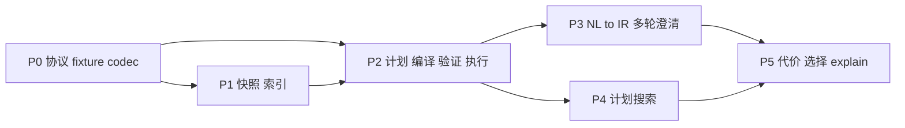

# KART 任务清单（Task）

- 版本：v0.1，2026-09-21
- 上游：`spec/requirement.md`、`spec/design.md`
- 用法：按阶段顺序执行；每项含验收条件；`依赖` 指向其他任务编号；`OI-x` 指向 requirement.md 第 7 节的开放议题。完成后勾选并在括号内记录日期。
- 阶段验收未通过不进入下一阶段。P0–P2 全程可在无 LLM 环境下完成；P0 与大部分 P2 可在无 HBase 环境（MemoryBackend）下完成。

---

## P0 协议、fixture 与编码原语

目标：不连 HBase、不连 LLM，fixture 的 IR / Plan / codec 全部可测。

- [x] **T0.1 Maven 骨架** (2026-09-22)：`pom.xml`（Java 8 编译级别、design.md §1.1 依赖）、`kart.cli.Main`（picocli 根命令）、`scripts/build.sh`、`scripts/run.sh`。
  验收：WSL 内 `mvn -q package` 成功；`run.sh --help` 列出全部子命令。
- [x] **T0.2 doctor 命令** (2026-09-22；ZK 未起时连接失败属预期)：检查 JDK 版本、读取 `config/hbase/hbase-site.xml`、连接 ZooKeeper、`Admin.listTableNames()`、打印 hbase-client 与 server 版本、检查 `LLM_*` 环境变量是否存在（不校验有效性）。
  验收：在 WSL 内对现有 HBase 2.2.3 运行返回 OK；依赖冲突（OI-8）在此解决并记录到 `docs/environment-lock.md`。
- [x] **T0.3 配置加载** (2026-09-22)：`config/environment.example.yaml`、`layout.yaml`（S=4、256、600000 ms、L=8）、`planner.yaml`（预算）、`regions.yaml`（空）；YAML → `AppConfig`。
  验收：缺失配置项使用默认值并打印告警；非法值（S=0、L>16）启动失败。
- [x] **T0.4 JSON Schema** (2026-09-22)：`schemas/draft-ir`、`bound-ir`、`plan`、`action-selection`；全部 `additionalProperties=false`、枚举化 op/field。
  验收：每个 Schema 至少 3 个合法样例通过、5 个非法样例（多字段、错枚举、类型错、缺必填、出现 `startRow`）被拒。
- [x] **T0.5 编码原语** (2026-09-22)：`Bytes`（U8/U32/U64 大端 + 无符号比较器）、`RowKeyCodec`（五张表的 encode/decode）、`PrefixSuccessor`。
  验收：jqwik 性质测试：encode∘decode = id；字节序与数值序一致；全 0xFF 前缀返回 empty。
- [x] **T0.6 TimeBucket 与 ZOrder** (2026-09-22)：桶枚举 `[a,b)`；Morton 交织/解交织；矩形 → 单元范围 → Morton 区间分解与合并；`max_ranges` 合并策略。
  验收：随机矩形的区间并集 ⊇ 单元集合（性质测试）；相邻区间已合并；区间数 ≤ 上限且不丢单元。
- [x] **T0.7 Catalog 模型** (2026-09-22)：`Manifest`、`IndexDescriptor`、`StatsSnapshot` 的 Java 类与 JSON 序列化；`CatalogStore` 的文件实现。
  验收：design.md §4.7 示例 JSON 往返一致；status 只能 BUILDING→READY。
- [x] **T0.8 MemoryBackend** (2026-09-22)：`KvBackend` 接口 + `TreeMap` 实现，`scan(start,stop)` 半开、`get(List)`。
  验收：与 RowKeyCodec 组合的扫描顺序测试通过。
- [x] **T0.9 数据模型与 fixture** (2026-09-22)：`CanonicalPoint`、`Trajectory`、`Chunk`、点载荷编解码；`build-fixture` 生成 IMPLEMENTATION_PLAN.md §18 的 R/A/B/C（坐标直接作为米制，时间 2008-02-02 08:00 +08:00 起）。
  验收：`testdata/fixture-v1/` 生成确定（两次生成 checksum 相同）。
- [x] **T0.10 FullScanOracle** (2026-09-22；度量扩展 2026-09-25)：对 BoundIR 遍历全部块，输出 TrajectoryIds 或 Top-K（DTW / 离散 Fréchet / 对称 Hausdorff）。
  验收：fixture 上时空 + Top-2 查询返回 [A,B] 且 C、R 不在其中；DTW 手算值一致。

**P0 阶段验收**：`mvn test` 全绿；`build-fixture`、`doctor` 可运行。

---

## P1 快照构建与索引

目标：全量 T-Drive 写入 HBase，三张索引 posting 全量校验通过，manifest READY。

- [x] **T1.1 TDriveParser** (2026-09-22)
  验收：对 `part-00000` 前 100 行解析数量、点数与手工统计一致；构造 5 种坏行全部进入拒绝报告。
- [x] **T1.2 Projection（Proj4J）** (2026-09-22)
  验收：北京天安门等 3 个已知点与外部工具（如 pyproj）结果差 < 0.01 m；往返误差 < 1e-6 度。
- [x] **T1.3 profile-data 命令** (2026-09-22)
  验收：报告生成；据此关闭 OI-9（写入 requirement.md）并确定 manifest 的 domain 与 epoch。
- [x] **T1.4 Cleaner + Chunker** (2026-09-22)
  验收：单测覆盖重复点、同 t 不同位、域外轨迹、恰好 256/257 点；性质测试：块拼接后 = 原轨迹。
- [x] **T1.5 tid 分配与 traj_meta / traj_raw 写入** (2026-09-22；全量 HBase 以 `tdrive_v1_ready` 验收 2026-09-25)
  验收：fixture 写入后 Get 回读一致；表 Region 数 = 4。全量证据：READY manifest（约 47,102 轨迹）+ smoke 24/24（见 `docs/experiment-scope.md`）。
- [x] **T1.6 IndexBuilders** (2026-09-22)
  验收：fixture 上手工推导的 posting 键集合与实际写入完全相等。
- [x] **T1.7 PostingVerifier + verify-snapshot 命令** (2026-09-22)
  验收：错误注入（删一条 posting / 多写一条）必被检出并定位到 (table, tid, chunk)。
- [x] **T1.8 StatsBuilder** (2026-09-22)
  验收：stats JSON 可加载；抽样比例误差 < 20%。
- [x] **T1.9 build-snapshot 命令** (2026-09-22；全量 HBase 发布以 `tdrive_v1_ready` 验收 2026-09-25)
  验收：全量 21 个文件在 WSL 内成功发布 `tdrive_v1_ready`；manifest READY + smoke/chat 验收作为实测证据。全量 `verify-snapshot` 另开（耗时，非本阶段门禁）。

**P1 阶段验收**：`verify-snapshot tdrive_v1_ready` 全量通过；MemoryBackend 上 fixture 的候选集合 ⊇ Oracle 匹配块（性质测试）。

---

## P2 确定性计划、编译、验证与执行

目标：`query-ir` 对 fixture 与 T-Drive 固定查询集与 Oracle 完全一致。

- [x] **T2.1 算子类型系统与 PlanEnvelope** (2026-09-23)：`Op` 枚举、输入/输出类型签名、`PlanNode`、拓扑序校验、Schema 校验。
  验收：类型不匹配（INTERSECT 输入 ChunkBatch）被 StructureCheck 拒绝。证据：`PlanValidatorTest`、`kart.plan.*`。
- [x] **T2.2 PlanBuilder（构造器）** (2026-09-23)：从访问子图 + IR 自动补齐后缀，生成 P_T / P_Z / P_H / 交集族 / P_FULL；规范化签名（同构计划去重）。
  验收：fixture 时空 Top-K 查询生成 P_T、P_Z、P_TZ、P_FULL 四个候选，签名互异。证据：`PlanBuilder` + `QueryIrFixtureTest` / diff 套件。
- [x] **T2.3 IndexAdapter + QueryCompiler** (2026-09-23)：Time/ZOrder/Hash 三个适配器输出 ScanTask（表、start/stop 字节、shard、coverage_ref）；Get 列表生成；`PhysicalPlan` 序列化（字节以 hex）。
  验收：编译结果用 RowKeyCodec 反解，桶/单元/hash 与 IR 推导值一致；同输入两次编译字节相同。证据：`kart.compile.*` + `PlanDiffPropertyTest`。
- [x] **T2.4 PlanValidator 四层检查** (2026-09-23)：Structure / Semantic / Coverage / PhysicalSafety；`SafePlanHandle` 包私有构造。
  验收：design.md §9 每条规则各有至少一个负例测试；外部 JSON 带 `safe:true` 被忽略。证据：`PlanValidatorTest`。
- [x] **T2.5 执行算子** (2026-09-23)：Scan/Get 读取、集合运算、`FetchTrajectoryChunk` 分批、`ExactSTFilter`、`ProjectTrajectoryIds`、`ExcludeReference`、`BatchGetTrajectory`（复用已读块）、`Dtw`（滚动数组、cell 计数）、`TopK`、`ReturnTrajectoryIds`（映射外部 ID）。
  验收：每算子单测；DTW 与 Oracle 实现共享同一函数。证据：`ExactSTFilterTest`；`Coordinator` + fixture/Oracle 对齐测试。
- [x] **T2.6 Coordinator + HBaseBackend** (2026-09-23；2026-09-24 对齐)：拓扑执行、资源上限、失败状态、逐算子 trace；`HBaseBackend` 已实现。
  验收：人为设 `max_candidate_chunks=1` 返回 RESOURCE_EXHAUSTED 且无结果；删除一块 raw 行返回 DATA_INTEGRITY_ERROR；`soft_memory_bytes` 极小 → RESOURCE_EXHAUSTED。证据：`CoordinatorFailureTest`。索引分支并行（`ExecLimits.indexParallelism`）；`max_exec_ms` 在节点/Scan 回调/相似度循环检查；trace 含 `emitted_ranges` + `client_ops`（页估），真 `rpc_count` 不可得为 null。
- [x] **T2.7 query-ir 命令** (2026-09-23)：读 BoundIR JSON → 用 RulePolicy 枚举全部候选 → 验证 → 由 **PlanSelector**（T5.6：min `estimated_ms`，再少区间，再 `plan_id`）选计划 → 执行 → 输出结果 + trace JSON 到 `runs/<run_id>/`。
  验收：fixture 上结果 [A,B]；与 Oracle 一致。证据：`QueryIrCmd` / `QueryEngine` → `PlanSelector`；`QueryIrFixtureTest`。（历史固定顺序 `PlanSelectorP2` 仅作对照，query 路径不再使用。）

- [x] **T2.8 差分测试套件** (2026-09-22)：jqwik 随机轨迹/矩形/时间区间，在 MemoryBackend 上对全部候选计划族断言 `ExactFilter(Candidates) == Oracle`；覆盖 requirement FR-7.3 列举场景。
  验收：1000 次迭代通过；每个场景有命名测试。
- [x] **T2.9 T-Drive 固定查询集** (2026-09-22；扩展 2026-09-25)：`experiments/workloads/tdrive_smoke.json` **24** 条 BoundIR（四类 × 小/大范围 + Top-K，含 DTW / FRECHET / HAUSDORFF），Oracle 结果缓存。
  验收：真实 HBase 上 `query-ir` 全部与 Oracle 一致（smoke **24/24**）；记录每条的候选数、扫描区间数、耗时。

**P2 阶段验收**：T2.8、T2.9 全部通过；IR 与 Plan JSON 不含 RowKey 字节。

---

## P3 自然语言到 IR 与多轮澄清

目标：`query-nl`/`chat` 实验路径用真实 API 完成端到端；单元回归用 test-only `ScriptedLlmClient`。

- [x] **T3.1 LlmClient 接口 + OpenAiCompatibleClient** (2026-09-23)：`HttpURLConnection` 实现 chat/completions；temperature=0；超时；调用记录（tokens、延迟、原始输出）；密钥只从环境读。
  验收：对任一 OpenAI 兼容端点发一条固定 prompt 返回 JSON（OI-1：在此探测 `response_format=json_object` 是否可用并记录）。证据：`OpenAiCompatibleClient`；真实端点探测需设 `LLM_*`（本机未强制）。
- [x] **T3.2 ScriptedLlmClient（test-only）** (2026-09-25)：有序固定回复，仅挂在 `src/test`；已移除生产 `MockLlmClient` / `testdata/llm-mock` / CLI `--mock`。
  验收：Dialog 澄清、DraftIR 修复、LLM policy 接线等用例不依赖 Live API。证据：`src/test/java/kart/llm/ScriptedLlmClient.java` + `QueryNlAcceptanceTest` / `QueryEngineLlmPolicyTest`。
- [x] **T3.3 PromptBuilder** (2026-09-23)：系统提示 = 逻辑目录（字段、四类查询、语义说明）、DraftIR Schema 摘要、2–3 个示例、"不知道就留空并写入 missing"规则、预注册区域名列表。
  验收：prompt 中不出现表名、RowKey、shard、bucket 等物理词。证据：`PromptBuilder` + acceptance 测试。
- [x] **T3.4 DraftIR 解析与修复** (2026-09-23)：抽取 JSON → Schema 校验 → 失败附错误重试 ≤2 次 → 仍失败返回 INVALID_IR。
  验收：Scripted 返回一次坏 JSON 再返回好 JSON 的用例通过；三次坏 JSON 返回 INVALID_IR。证据：`DraftIrParser` + `QueryNlAcceptanceTest`。
- [x] **T3.5 ClarificationDetector** (2026-09-23)：按 result mode 推导必填项；对 missing 生成问题列表；已在上下文中的信息不再问。
  验收：缺日期 → 只问日期；缺区域和 K → 一次问两项；用户已给日期 → 不重复。证据：`ClarificationDetector` + acceptance。
- [x] **T3.6 IrBinder** (2026-09-23)：时区 Asia/Shanghai → epoch_ms；经纬度矩形 → UTM 矩形（四角投影取包围盒）；region_name → 矩形；trajectory_id → tid（查 traj_meta）；跨字段规则（design.md §5.3）；注入 snapshot。
  验收：design.md §5.3 每条规则有正/负例；参考 ID 不存在返回明确错误。证据：`IrBinder` + `IrBinderTest`；`config/regions.yaml` 含 beijing_core / fixture_box。
- [x] **T3.7 CLI Dialog 状态机** (2026-09-23)：Parsing / Clarify / Confirm / Planning / Unsupported / Failed；澄清轮数 ≤3；语义摘要打印（含"采样点语义"说明）。
  验收：Mock 驱动的脚本化会话（含一次澄清 + 一次确认）走到 Planning。证据：`Dialog` + `clarificationDialogReachesPlanningAndReturnsAB`。
- [x] **T3.8 query-nl 命令** (2026-09-23)：Dialog → BoundIR → 复用 T2.7 的规划执行路径；LLM 不可用时提示改用 `query-ir`。
  验收：Mock 下端到端返回 fixture 的 [A,B]；真实 API 下 5 条示例句中缺信息的句子发起澄清而非编造。证据：`QueryNlCmd` + acceptance（真实 API 未在 CI 强制）。

**P3 阶段验收** (2026-09-23)：模型输出无法改变 snapshot / RowKey / 表名（测试：Mock 返回含 `startRow` 字段的 IR 被拒）；COUNT 请求返回 UNSUPPORTED_QUERY。证据：`QueryNlAcceptanceTest`。

---

## P4 LLM 引导的有限预算计划搜索

目标：产生结构不同的安全候选；非法动作不进入成本选择。

- [x] **T4.1 SearchState + LegalActionGenerator** (2026-09-23)：根据 IR 谓词与目录生成 START / INTERSECT / REPLACE / FINISH；签名去重。
  验收：只有 temporal 的 IR 不生成 zorder 动作；已用索引不再 START。证据：`kart.search.*` + `BeamSearchAcceptanceTest.t41_*`。
- [x] **T4.2 RulePolicy** (2026-09-23)：固定顺序枚举（单索引 → 两路 → 三路 → FINISH）。
  验收：与 T2.2 的候选族一致。证据：`RulePolicy` + `BeamSearchAcceptanceTest.t42_*`。
- [x] **T4.3 LlmProposalPolicy** (2026-09-23)：state 摘要 + legal actions + CostCard → LLM → `action_id`；非法 → 记录并回退 RulePolicy。
  验收：Mock 返回非法 action_id 时搜索仍完成，日志标记 `illegal_action`。证据：`LlmProposalPolicy` + `t43_*`。
- [x] **T4.4 BeamSearch + SearchBudget + SearchLog** (2026-09-23)：beam=3；`max_llm_calls / max_candidates / max_plan_ms / 停滞` 任一触发即停；始终保留 P_FULL。
  验收：预算设 `max_llm_calls=0` 退化为 RulePolicy；日志每步含 legal、选择、合法性、fast cost。证据：`BeamSearch` + `t44_*`。
- [x] **T4.5 Fast Cost 接入搜索** (2026-09-23)：对每个 FINISH 后的补全计划算 CostCard 供策略参考与 frontier 排序。
  验收：CostCard 字段齐全；`uncertainty.sample_size` 来自 stats。证据：`kart.cost.FastCost` / `CostCard` + `t45_*`。
- [x] **T4.6 搜索输出接 PlanValidator** (2026-09-23)：候选逐个验证，形成 SafePlan 集合与出局原因列表。
  验收：人工注入一个漏后缀的候选被 SemanticCheck 拒绝并出现在报告中。证据：`SearchResult` + `t46_*`。

**P4 阶段验收** (2026-09-23)：fixture 时空 Top-K 查询在 Mock 下产生 ≥2 个结构不同的 SafePlan；`explain` 能展示搜索日志（部分）。证据：`p4_mockProducesAtLeastTwoDistinctSafePlanSignatures`；`ExplainCmd` 输出 search log。

---

## P5 代价模型、选择与可观测

目标：不执行候选即可选择；explain 完整；MVP 验收全部通过。

- [x] **T5.1 CostFeatures 提取** (2026-09-23)：从编译后 PhysicalPlan 与 stats 提取 design.md §10 各特征；缺失统计用保守上界并标记。
  验收：fixture 上特征值与手工推导一致。证据：`kart.cost.CostFeatures` / `CostFeaturesExtractor` + `CostModelTest.t51_*`。
- [x] **T5.2 CostModel（Fast/Final 共用公式）** (2026-09-23；系数校准 2026-09-24)：系数来自 `planner.yaml`；初值曾标 `calibrated=false`，现仓库默认 **`calibrated: true`**（`fit-cost` / FeedbackCalibrator）。Final 用精确区间数。
  验收：P_TZ 与 P_T 在"时间窄、空间宽"与"时间宽、空间窄"两组统计下估价排序相反（验证模型对输入敏感）。证据：`CostModel` + `CostModelTest.t52_*`；`docs/environment-lock.md` / `docs/how-to-run.md`。
- [x] **T5.3 PlanSelector**：SafePlan 中取最小 `estimated_ms`，tie 规则确定。
  验收：相同估价时选择稳定。证据：`kart.cost.PlanSelector` + `CostModelTest.t53_*`。
- [x] **T5.4 ExecutionTrace 完整化** (2026-09-23；2026-09-24)：逐节点 rows/bytes/elapsed/`emitted_ranges`/`client_ops`、候选数、去重数、回表数、过滤通过数、dtw_cells、LLM 调用与 token；真 HBase `rpc_count` 不可得为 null。
  验收：`runs/<run_id>/trace.json` 符合 IMPLEMENTATION_PLAN.md §16 结构。证据：`ExecutionTrace` + `ExecutionTraceP5Test.t54_*`。
- [x] **T5.5 explain 命令** (2026-09-23)：不执行数据读取，输出 BoundIR、候选、验证报告、CostCard、选中计划、物理请求摘要（hex 区间 + 可读桶/单元）。
  验收：输出中物理字节只在 PhysicalPlan 段出现。证据：`ExplainCmd` + `ExecutionTraceP5Test.t55_*`。
- [x] **T5.6 query-ir / query-nl 切换到 Selector** (2026-09-23)：替换 T2.7 的固定顺序。
  验收：T2.9 固定查询集重新跑仍全部与 Oracle 一致。证据：`QueryEngine` → `PlanSelector`；`scripts/run-tdrive-smoke.sh`。
- [x] **T5.7 失败路径演示脚本** (2026-09-23；2026-09-24)：超预算、数据缺失、不支持查询、LLM/解析失败四类证据。
  验收：状态码分别为 RESOURCE_EXHAUSTED / DATA_INTEGRITY_ERROR / UNSUPPORTED_QUERY / 解析失败，且无部分结果。证据：`./scripts/kart.sh demo-failures` + `CoordinatorFailureTest` / NL acceptance。
- [x] **T5.8 README 与环境锁定文档** (2026-09-23)：`README.md`（实际验证过的命令）、`docs/environment-lock.md`（版本、依赖冲突解决）、`docs/supported-semantics.md`。
  验收：按 README 在干净 WSL 会话中可复现 doctor → build-snapshot → query-nl。证据：上述文档 + `USER_ACTIONS.md`。

**P5 阶段验收 = requirement.md §8 MVP Done 全部 8 条。** (2026-09-23；live LLM / 全量 HBase 项见 `USER_ACTIONS.md`)

---

## 依赖关系概览

P3 与 P4 可并行；两者都只依赖 P2 的 BoundIR 与候选执行路径。

## 与开放议题的关联

| 议题 | 在哪个任务关闭 |
|---|---|
| OI-1 LLM 供应商 / JSON mode | T3.1 |
| OI-8 hbase-client 依赖冲突 | T0.2 |
| OI-9 域外坐标处理 | T1.3 |
| OI-10 预注册区域表 | T3.3 / T3.6（`config/regions.yaml` 内容由用户提供） |
